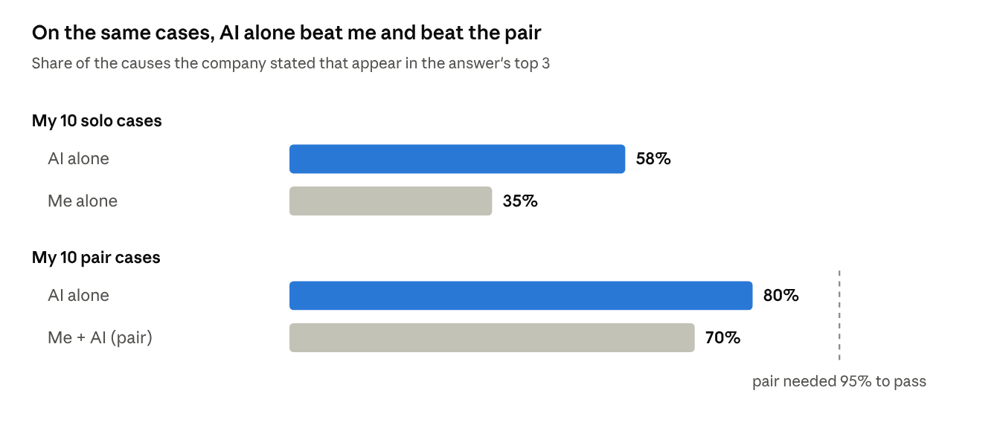
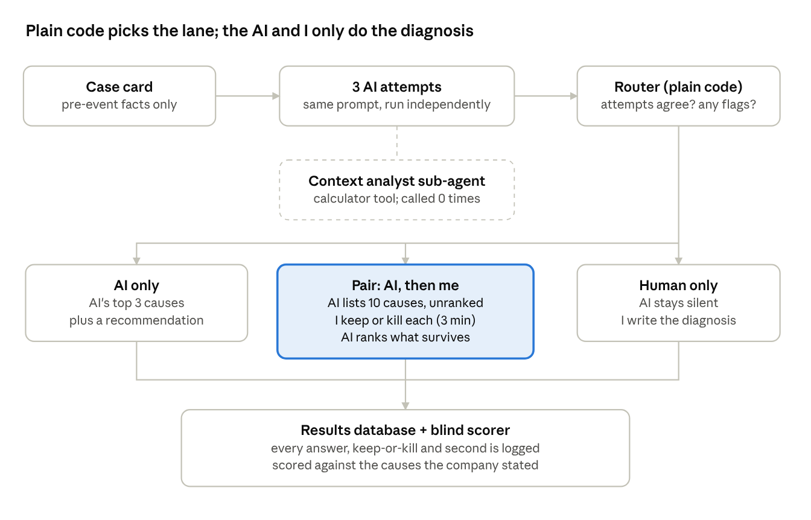
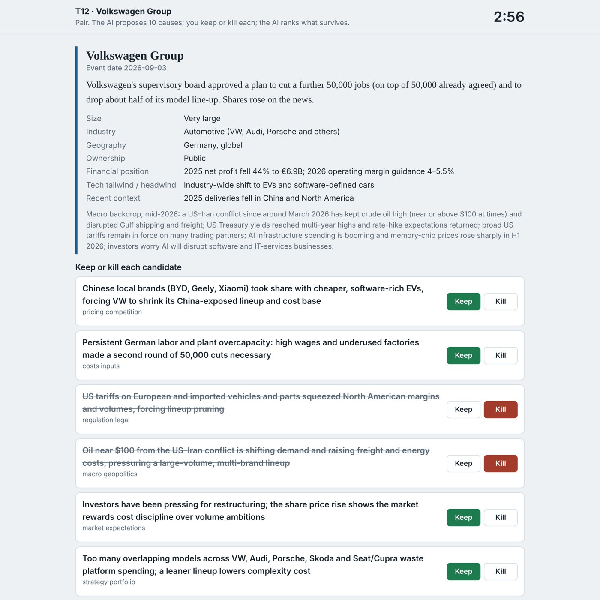

# Diagnosis Lab

**Human, AI or both: when is an expert's time worth adding to an AI's diagnosis?**

100xEngineers Cohort 7 capstone, Collaborative Intelligence. Solo project by Deepak.

- **Public demo, no login needed:** `demo.html` on this repo's GitHub Pages site. It is the real interface, replaying the AI replies recorded during the experiment.
- **Case study:** `case-study.html`, also published on Medium.
- **Live version:** runs inside claude.ai (it calls Claude on the viewer's own account, so viewers need to be signed in).

Diagnosis Lab tests one repeated task: explaining *why* a real business event happened, such as a profit warning, a layoff or a share crash. It runs three setups on the same cases (me alone, AI alone, and me plus AI as a pair), plus a router that decides which setup a case should get.

## Result

20 real events from July to October 2026, all after the AI's training data ends. Score = coverage: the share of causes the company or reputable press stated that appear in the answer's top 3.

| Setup | Cases | Stated causes found | Same cases, AI alone | My minutes |
| --- | --- | --- | --- | --- |
| AI alone | 20 | 69% | — | 0 |
| Me alone | 10 | 35% | 58% | 33.6 |
| Pair (me + AI) | 10 | 70% | 80% | 35.8 |
| Routed system (estimate) | 19 | 68% | — | 13.5 |

**Kill condition, fixed before scoring:** the pair must beat AI alone by 15 points on the same cases. It came in 10 points *below*. The pair tied AI alone on 8 cases, lost 2 and won none; both losses came from my "kill" decisions removing correct causes. The router caught 1 of the 3 cases where the AI missed most causes.

## How it works

1. **Case card:** facts known before the event only.
2. **Three AI attempts:** the same diagnostician prompt, run independently.
3. **Router (plain code, not AI):** agreement between the attempts plus case flags (private, regulated, unusual finances, new leader) pick a lane: AI only, pair, or human only.
4. **Pair lane:** the AI lists 10 unranked candidate causes; I keep or kill each and may add my own (3 minutes plus 1 minute overtime); the AI ranks the survivors. My additions are guaranteed a top-3 place.
5. **Logging and blind scoring:** every answer, decision and second is stored; an AI scorer matches answers to the stated causes without knowing which setup wrote them. I re-checked 5 of its decisions and agreed with all 5.

### Where the agent is

| Part | Kind |
| --- | --- |
| Diagnostician: reads the card, returns top 3 causes, decides whether to call the analyst | Agent |
| Context analyst: answers one question in its own context, using a calculator | Sub-agent (called 0 of 69 times) |
| Calculator | Tool (plain code) |
| Candidate generator, ranker, scorer | Single AI calls |
| Router, timer, random assignment, scoring maths | Plain code |

## Files

| File | What it is |
| --- | --- |
| `index.html` | The live application for claude.ai: UI, all prompts, router, guardrails, scoring and results, in one file |
| `demo.html` | Public demo: the same interface, replaying the recorded runs, no login |
| `case-study.html` | The case study |
| `PROMPTS.md` | Every prompt and rule, verbatim |
| `cases.json` | The 26 case cards (3 practice, 23 test), pre-event facts only |
| `answer_keys.json` | The stated causes and source links for each case |
| `results_by_case.csv` | One row per test case: setup, coverage, AI-alone coverage, minutes, rules version |
| `run_log.json` | Full export: every run, AI attempt, score, scorer check and the random schedule |
| `*.png`, `*.jpg` | Architecture diagram, results chart and screenshots |

## Guardrails

- Case cards contain only facts known before the event.
- Every AI reply uses a fixed JSON format; one retry, then the failure is logged.
- The AI may answer "not enough information" instead of guessing.
- Time saved is never reported without the router's catch rate (Goodhart's law).
- The scorer never knows which setup wrote an answer; answer keys are read only at scoring time.

## Why a builder-run test still tells us something

I was the builder and the only human tested, which breaks the brief's "not you" rule. I closed off my three conflicts of interest:

- **Knowing the answers:** I saw only titles; the stated causes sat in a separate table read only at scoring; every event post-dates the AI's training data.
- **Wanting the pair to win:** code randomly assigned cases to "me alone" or "pair"; the kill condition was fixed before scoring; the scorer was blind and spot-checked.
- **Tuning on the test:** tuning only on 3 practice cases; both mid-run rule changes logged and made before any score existed.

The result went against my own hypothesis, which is the strongest sign my bias didn't drive it. What it can't fix: one expert is one data point, I knew which setup I was in, and 20 runs is fewer than the 30 the brief asks for.

## What I'd build next

- Let the expert add causes, never delete the AI's.
- Route on novelty (new technology, new business models, post-training-cut-off shifts), not on agreement between attempts.
- Test a second practitioner who isn't the builder.
- Package it so it takes a company and an event, researches, builds the card, routes, and asks for review only when needed.
